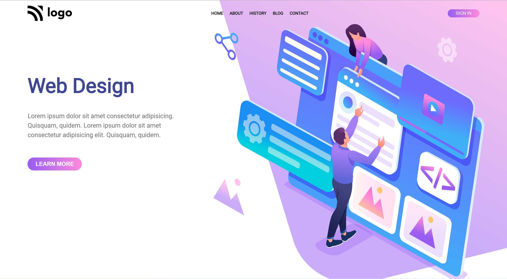

# This project Built With
#### 1.HTML
#### 2.CSS

## Acknowledgements
This landing page, took me almost 5 hrs to complete,this is my project 08 in fullstack development course by ineuron.in.

### During this project I've learned:

1.How to set background image.
2.How layout icons using positions.
3.How to make two divs close to each other.
4.How to postion element using CSS position properties.

## Here is screen shot of project 8.

## Here is live link
[Live link]()